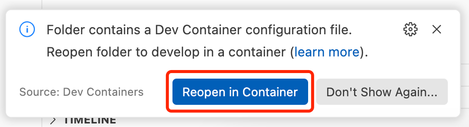

Install ROS 2 Workspace
=======================

This guide will walk you through setting up the ROS 2 workspace for your AhaRobot system.

Clone the Project
-----------------

Clone the astra_ws project and its submodules:

.. code-block:: bash

   git clone --recurse-submodules https://github.com/aha-robot-anonymous/astra_ws
   cd astra_ws

Set Up Docker Runtime (Recommended)
------------------------------------

If you prefer to isolate the ROS environment using Docker, AhaRobot provides a Dockerfile at https://github.com/aha-robot-anonymous/astra_ws/blob/main/.devcontainer/Dockerfile to create the runtime environment. We recommend using VSCode/Cursor to run this container. With the Dev Containers extension installed, open the folder and select "Reopen in Container" when prompted. VSCode will then automatically fetch dependencies and build the image in the background.

🤔 If downloads are slow, consider configuring an APT mirror in the Dockerfile or setting an HTTP(S) proxy via http(s)_proxy environment variables.

Install and Configure Python Packages and ROS Environment
----------------------------------------------------------

To enable AhaRobot's features, we maintain several patched Python packages. Some changes are not upstreamed due to maintenance or feature considerations, so these packages must be installed from source. Key modifications:

- **aiortc**: support for multiple MediaStream streams
- **PyAV**: enable AV1 encoding using libsvtav1
- **mr_urdf_loader**: fix URDF parsing bugs
- **urchin/pyribbit**: URDF parsing to support inverse kinematics

.. warning::
   If you are using Docker to isolate the environment, ensure you execute the following commands inside the container.

.. warning::
   Installing ROS together with Conda is not recommended. It can break ``ros2 run``/``ros2 launch`` and cause package import issues.

.. code-block:: bash

   # Make sure you are in the project root (astra_ws; inside Docker it is ~/ros2_ws)
   
   sudo apt update
   rosdep update
   rosdep install --from-paths src -y --ignore-src
   
   pushd non_ros_src/aiortc
   sudo apt install -y libopus-dev libvpx-dev
   pip install --upgrade pip setuptools
   pip install -e .
   popd
   
   pushd non_ros_src/pyribbit
   pip install "setuptools<=64.0.0"
   pip install -e .
   popd
   
   pushd non_ros_src/urchin
   pip install -e .
   popd
   
   pushd non_ros_src/mr_urdf_loader
   pip install -e .
   popd
   
   pushd non_ros_src/ModernRobotics/packages/Python
   pip install -U packaging
   pip install -e .
   popd
   
   pushd non_ros_src/astra_teleop
   pip install -e .
   popd
   
   pushd non_ros_src/astra_teleop_web
   pip install -e .
   popd
   
   pushd non_ros_src/PyAV
   
   sudo apt install -y python3-virtualenv libsvtav1enc-dev libx264-dev wget
   
   export PYAV_LIBRARY=ffmpeg-6.0
   source scripts/activate.sh
   ./scripts/build-deps
   # See: https://github.com/numpy/numpy/issues/22135
   pip install "setuptools<=64.0.0"
   make
   deactivate
   pip install -e .
   popd
   
   sudo add-apt-repository ppa:ubuntuhandbook1/ffmpeg6
   sudo apt install -y ffmpeg # upgrade ffmpeg to support libsvtav1
   
   pushd non_ros_src/lerobot
   pip install -e .
   pip install "huggingface_hub<0.25"
   popd
   
   pushd non_ros_src/odrive-can
   sudo apt install -y can-utils
   pip install -e .
   popd
   
   pip install pyserial python-can

We use a ROS 2 workspace to manage the environment. Build all packages in the current workspace and install into the workspace:

.. code-block:: bash

   # Ensure you are at the project root
   
   colcon build --symlink-install
   source install/setup.bash

🎉 You've finished configuring the ROS environment!

Launch AhaRobot
---------------

Bring up the CAN bus. Run these commands outside Docker to start the CAN network:

.. code-block:: bash

   # on host
   # sudo ip link set can0 down # if you want to reset the CAN bus
   sudo ip link set can0 up type can bitrate 250000 && sudo ip link set can0 txqueuelen 100

Start your AhaRobot and the web teleoperation UI:

.. code-block:: bash

   ros2 launch astra_controller start.launch.py
